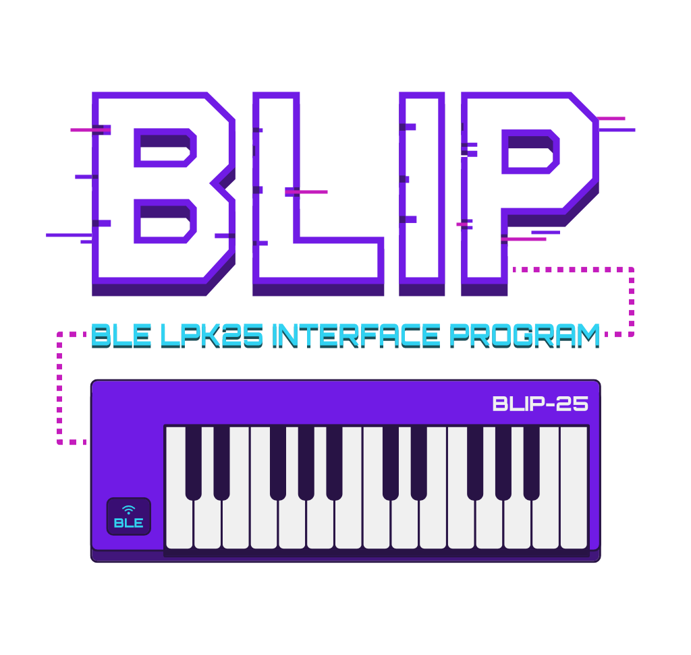
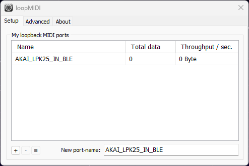

# 🎹 BLE LPK25 INTERFACE PROGRAM

[](https://opensource.org/licenses/MIT)


A high-performance Bluetooth LE MIDI bridge for the AKAI LPK25 Wireless keyboard, enabling seamless integration with Windows DAWs and music software!

## 🌟 Why This Project?

The AKAI LPK25 Wireless keyboard is a fantastic portable MIDI controller, but it faces a common challenge on Windows: native Bluetooth MIDI support is limited. This bridge solves that problem by:

- 🔵 Connecting directly to your LPK25 via Bluetooth LE
- 🎯 Creating a virtual MIDI port that your DAW can recognize
- 🚀 Providing ultra-low latency MIDI message forwarding
- 💪 Offering robust connection management and auto-reconnection

## 🤨 Note on AKAI's Windows Support

Despite the AKAI LPK25 Wireless having full hardware capabilities and Bluetooth LE MIDI being natively supported on modern Windows systems, AKAI did not provide an official solution for using the keyboard wirelessly on Windows. This project was born out of that unnecessary gap — proving that a seamless and performant bridge is not only possible, but relatively straightforward to implement with existing open technologies.

Sometimes, if you want something done right, you have to do it yourself.

## 📦 Prerequisites

Before using this bridge, you'll need:

1. Windows OS (tested on Windows 11)
2. [loopMIDI](https://www.tobias-erichsen.de/software/loopmidi.html) installed for virtual MIDI port creation
3. AKAI LPK25 Wireless keyboard with Bluetooth capability
4. A compatible USB Bluetooth BLE adapter (if not built-in)

## 🚀 Installation

1. Download the latest release from the [releases page](https://github.com/00xBAD/BLIP/releases)
2. Create a new virtual MIDI port in loopMIDI named "AKAI_LPK25_IN_BLE"

3. Run the executable

## 💻 Usage

1. Turn on your AKAI LPK25 Wireless keyboard
2. Pair the keyboard with Windows via Bluetooth settings
    > Note: It's normal for Windows to drop the connection after pairing
3. Launch the bridge application
4. Wait for the BLE scanning message in the terminal
5. Press the PAIR button on your LPK25
6. Wait for the connection to establish
7. The virtual MIDI port is now ready to use in your DAW!

## ⚙️ Configuration

You can modify these settings in the source code if needed:

```rust
//-----------------------------------------------------------------------------
// USER CONFIGURATION
// You can safely modify these values to customize the bridge behavior
//-----------------------------------------------------------------------------

// Set the loopMIDI virtual port name
// This must match the name of the virtual port created in loopMIDI
const VIRTUAL_MIDI_PORT_NAME: &str = "AKAI_LPK25_IN_BLE";

// BLE device scan timeout
const BLE_SCAN_TIMEOUT_SECS: u64 = 30;

// Connection keepalive interval
const BLE_KEEPALIVE_SECS: u64 = 10;

// Connection status check interval
const BLE_STATUS_CHECK_SECS: u64 = 1;

// Octave offset for transposing MIDI notes (-11 to +11 octaves)
const OCTAVE_OFFSET: i8 = 0;
```

## 🔧 Technical Details

The bridge works by:

1. 🔍 Scanning for BLE MIDI devices
2. 🤝 Establishing a connection with your LPK25
3. 📡 Converting BLE MIDI messages to standard MIDI
4. ▶️ Forwarding messages to the virtual MIDI port (loopMIDI)
5. 🔄 Maintaining connection stability with keepalive signals

## 🔍 Troubleshooting

### Common Issues

1. **Keyboard Not Found During Scanning**
   - Ensure the keyboard is powered on and in pairing mode (PAIR button pressed)
   - Verify that your Bluetooth adapter supports BLE
   - Try removing the keyboard from Windows Bluetooth devices and re-pair

2. **Connection Drops Frequently**
   - Check keyboard battery level
   - Ensure you're within reasonable range (10-15 feet) of the receiver
   - Try adjusting `BLE_KEEPALIVE_SECS` to a lower value

3. **No MIDI Input in DAW**
   - Verify loopMIDI port name matches `VIRTUAL_MIDI_PORT_NAME` in settings
   - Check if loopMIDI is running
   - Ensure your DAW has the virtual MIDI port enabled in its settings

4. **High Latency**
   - Close other Bluetooth applications that might interfere
   - Try reducing `BLE_STATUS_CHECK_SECS` value
   - Check if your system is under heavy load

For additional support, please [open an issue](https://github.com/00xBAD/BLIP/issues) on GitHub.

## 🏗️ Building from Source

### Prerequisites

1. Install [Rust and Cargo](https://rustup.rs/)
2. Install [Git](https://git-scm.com/downloads)
3. Install [Visual Studio Build Tools](https://visualstudio.microsoft.com/visual-cpp-build-tools/) with the following components:
   - Windows SDK
   - C++ build tools
4. Install [loopMIDI](https://www.tobias-erichsen.de/software/loopmidi.html)

### Build Steps

1. Clone the repository:
   ```bash
   git clone https://github.com/00xBAD/BLIP.git
   cd BLIP
   ```

2. Build the project:
   ```bash
   cargo build --release
   ```

3. Find the executable in `target/release/BLIP.exe`

### Development Build

For development and debugging, you can use:
```bash
cargo build
```
This will create a debug build in `target/debug/`.

### Running Tests

To run the test suite:
```bash
cargo test
```

## ⚠️ Legal Disclaimer

BLIP is an open-source tool for BLE communication with AKAI LPK25.
This project is not affiliated with AKAI Professional or the Bluetooth SIG.
LPK25 is a trademark of AKAI Professional, used here solely for descriptive purposes.

## 👥 Credits

This project was made possible by:

- 🧠 Main Code Implementation: Claude Sonnet 3.5
- 💡 Project Brainstorming & Overview: GPT-4o
- 👨‍💼 Project Supervision & Management: Fabio Corona

## ⭐ Contributing

Contributions are welcome! Feel free to:

- 🐛 Report bugs
- 💡 Suggest features
- 🔧 Submit pull requests
- 🐧 Port to Linux

## ☕️ Support Me!

If you find this project helpful, consider buying me a coffee!
Your support helps me create and maintain more tools like this.

[](https://ko-fi.com/N4N4RWQX7)

Thank you for your support! It means a lot and keeps the creativity flowing! ❤️

## 📄 License

This project is licensed under the MIT License - see the [LICENSE](LICENSE) file for details.

## 📞 Support

If you encounter any issues or have questions, please:

1. Check the [issues page](https://github.com/00xBAD/BLIP/issues)
2. Create a new issue if needed

Happy music making! 🎵✨
